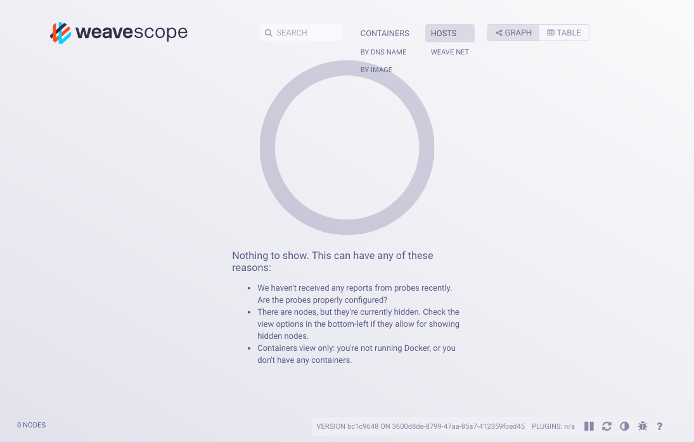
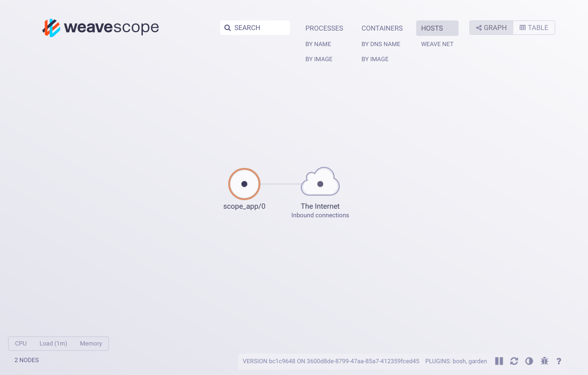
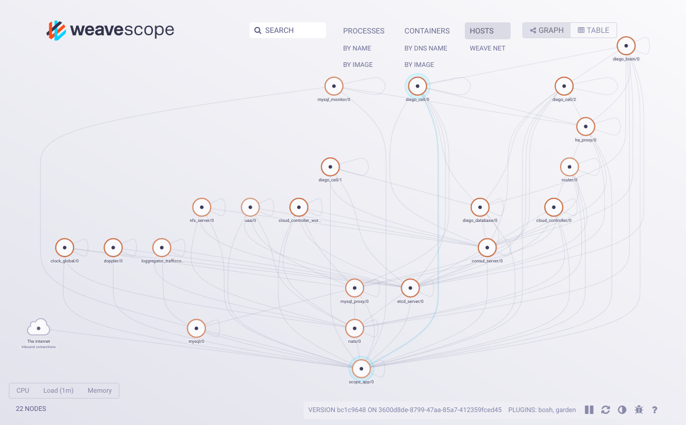

# Installation Guide for PCF
## Caution
**THIS IS AN EXPERIMENTAL RELEASE. DO NOT DEPLOY THIS IN PRODUCTION OR CUSTOMER ENVIRONMENTS. MAKE SURE THE SCOPE APP IS BEHIND A FIREWALL AND NOT PUBLICLY ACCESSIBLE.**
## Prerequisites
You will need the following information which can be retrieved from the Director and PCF ERT tiles in Ops Manager:
* Cloud Controller API: `$CF_API_URL`, e.g. `api.<ERT_SYSTEM_DOMAIN>`
* UAA Host: `$UAA_HOST`, e.g. `uaa.<ERT_SYSTEM_DOMAIN>`
* UAA Admin Client Secret: `$UAA_ADMIN_CLIENT_SECRET`
* BOSH Director VM Host: `$BOSH_HOST`
* BOSH Director PWD: `$BOSH_PWD`

## Procedure
1. [SSH into Ops Manager](https://docs.pivotal.io/pivotalcf/1-9/customizing/trouble-advanced.html#ssh)

1. [Target and log into BOSH](https://docs.pivotal.io/pivotalcf/1-9/customizing/trouble-advanced.html#log-in-uaa)

1. Clone weave-scope-release
    ```bash
    mkdir -p ~/workspace
    cd ~/workspace
    git clone https://github.com/st3v/weave-scope-release.git
    cd weave-scope-release
    ```

1. Upload the latest weave-scope-release to BOSH
    ```bash
    cd ~/workspace/weave-scope-release
    bosh upload release releases/weave-scope/weave-scope-$(git describe --abbrev=0 --tags | tr -d 'v').yml
    ```

1. Edit `~/workspace/weave-scope-release/manifests/pcf/scope-app.yml` as follows:
   * Replace `<SCOPE-APP-AZ>` with one of the names in the `azs` section retrieved from `bosh cloud-config`
   * Replace `<SCOPE-APP-VM-TYPE>` with one of the name in the `vm_types` section retrieved from `bosh cloud-config`, e.g. `medium.cpu`:
   * Replace `<SCOPE-APP-NETWORK>` with one of the names in the `networks` section retrieved from `bosh cloud-config`

1. Deploy the Scope App:
    ```bash
    bosh -d ~/workspace/weave-scope-release/manifests/pcf/scope-app.yml deploy
    ```

1. Verify the Scope App is up and running by pointing your browser at the IP address assigned to the Scope App instance and port `4040`. You can obtain the IP via `bosh vms weave-scope`. If everything went well, you should see the following.

   

1. Add a new CF read-only admin client used by the Scope Probe to access the CF API. Note, choose a proper client-secret.
   ```bash
   uaac target $UAA_HOST --skip-ssl-validation
   uaac token client get admin -s $UAA_ADMIN_CLIENT_SECRET
   uaac client add scope-cf-admin-ro \
     --name scope-cf-admin-ro \
     --secret scope-cf-admin-ro-secret \
     --authorized_grant_types client_credentials,refresh_token \
     --authorities cloud_controller.admin
   ```

1. Edit `~/workspace/weave-scope-release/manifests/pcf/runtime-config.yml` as follows:
   * Set property `weave.scope.probe.cf.api_url` to `$CF_API_URL`
   * Set properties `weave.scope.probe.cf.client_id` and `weave.scope.probe.cf.client_secret` to the credentials chosen for the UAA client created in the previous step.

1. Check the currently active BOSH runtime-config by executing `bosh runtime-config`. If the currently active runtime-config is not empty, you will have to merge it with the one specified in `~/workspace/weave-scope-release/manifests/pcf/runtime-config.yml`.

   Update the BOSH `runtime-config`:
   ```bash
   bosh update runtime-config ~/workspace/weave-scope-release/manifests/pcf/runtime-config.yml
   ```

   Make sure runtime-config has been set by running `bosh runtime-config`.

1. Re-deploy the Scope App:
    ```bash
    bosh -d ~/workspace/weave-scope-release/manifests/pcf/scope-app.yml deploy
    ```

1. In your browser go to the Scope App and verify that it displays a host that represents the Scope App instance.

   

1. Assuming all is well, re-deploy ERT by clicking `Apply Changes` in the Ops Manager UI or doing the following:
   ```bash
   bosh download manifest $(bosh deployments | grep -e 'cf-[[:alnum:]]\{20\}' | cut -d'|' -f2) /tmp/cf.yml
   bosh -d /tmp/cf.yml deploy
   ```

1. Watch the CF hosts appear in the Scope App UI.

   
