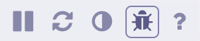

# Creating a Static Local Copy of your Deployment
Sometimes you want to show a local copy of your Cloud Foundry deployment, without maintaining a connection to the deployed Scope App and Probes. This is easy to do with the Scope debugging menu.

## Prerequisites
* A running Scope App that shows the topology you wish to export and display locally
* Docker

## Procedure
1. Visit the running Scope App in your browser.

1. Click the Troubleshooting menu in the bottom right of your Scope window:

   

1. Select JSON download from the window that appears:

   

1. Run the following Docker command from the directory where you downloaded your JSON file to:

    ``` bash
    docker run --rm -v $PWD/report.json:/tmp/report.json \
           -p 4040:4040 weaveworks/scope:latest_release \
           --mode=app --weave=false --app-only \
           --app.collector=file:///tmp/report.json
    ```

1. Weave Scope should now be available on [http://localhost:4040](http://localhost:4040), displaying your JSON data file.
